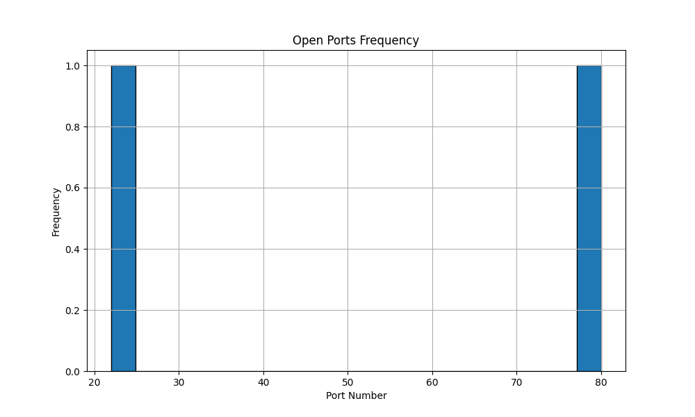

# Advanced Python Port & Subnet Scanner

A multi-threaded network scanner tool with GUI built using Python and Tkinter. Features include:

* Single target or subnet (CIDR) scanning
* Real-time live scan progress via GUI
* Banner grabbing and basic vulnerability check
* Graph generation of open ports using Matplotlib
* Results saved as TXT, CSV, JSON

---

## ✅ Features

* **Multi-threaded Port Scanning**
* **Subnet Scanning Support**
* **Real-time GUI Feedback**
* **Vulnerability Signature Check**
* **Result Visualization with Matplotlib**

---

## 💻 Requirements

* Python 3.x
* tkinter (comes with Python)
* matplotlib
* pillow

Install dependencies:

```bash
pip install -r requirements.txt
```

Or manually:

```bash
pip install matplotlib pillow
```

---

## 🚀 How to Run

1. Clone the repository:

   ```bash
   git clone https://github.com/yourusername/advanced-port-scanner.git
   cd advanced-port-scanner
   ```
2. Launch the GUI:

   ```bash
   python gui.py
   ```

---

## 📂 Project Structure

```
AdvancedPortScanner/
├── scanner.py
├── gui.py
├── results/
├── README.md
├── requirements.txt
```

---

## 🖼️ Example Screenshot



---

## ⚠️ Disclaimer

For educational and ethical use only. Do not scan networks without permission.

---

## ✍️ Author

Joseph Jonathan Fernandes

---

## 📄 License

MIT License
